# Dolphin TankOps - Sơ đồ luồng hoạt động

Tài liệu kèm theo [README.md](README.md). Mỗi mục hiển thị ảnh sơ đồ đã render sẵn (PNG trong `docs/workflows/`) để đọc được ở mọi trình xem Markdown, kể cả nơi không hỗ trợ Mermaid. Mã Mermaid gốc nằm trong khối "Mã Mermaid - nguồn sơ đồ" ngay dưới ảnh để chỉnh sửa và render lại.

## Bảng màu sơ đồ

Mọi sơ đồ dùng chung các lớp `classDef` dưới đây, nên màu hiển thị giống nhau ở tất cả sơ đồ.

| Lớp | Màu | Ý nghĩa |
|---|---|---|
| `ui` | Xanh dương nhạt | Giao diện, component React |
| `data` | Vàng nhạt | Dữ liệu và lưu trữ |
| `ai` | Tím nhạt | Thành phần AI, RAG |
| `ok` | Xanh lá nhạt | Nhánh thành công, đạt |
| `bad` | Đỏ nhạt | Nhánh chặn, không đạt |
| `warn` | Hổ phách | Điều kiện, trạng thái chờ |
| `nav` | Navy | Điểm vào, hằng số trung tâm |

## Mục lục

1. [Kiến trúc tổng thể](#1-kiến-trúc-tổng-thể)
2. [Vòng đời ca làm việc](#2-vòng-đời-ca-làm-việc)
3. [Luồng nghiệp vụ 3 bước](#3-luồng-nghiệp-vụ-3-bước)
4. [Nhánh Wall Wash](#4-nhánh-wall-wash)
5. [Nhánh Water White](#5-nhánh-water-white)
6. [Luồng bằng chứng ảnh](#6-luồng-bằng-chứng-ảnh)
7. [Luồng AI Copilot và RAG](#7-luồng-ai-copilot-và-rag)
8. [Pipeline xây kho RAG](#8-pipeline-xây-kho-rag)
9. [Quản lý đội tàu và hầm](#9-quản-lý-đội-tàu-và-hầm)
10. [Bản đồ action của reducer](#10-bản-đồ-action-của-reducer)
11. [Luồng kiểm thử](#11-luồng-kiểm-thử)
12. [Render lại sơ đồ](#12-render-lại-sơ-đồ)

---

## 1. Kiến trúc tổng thể

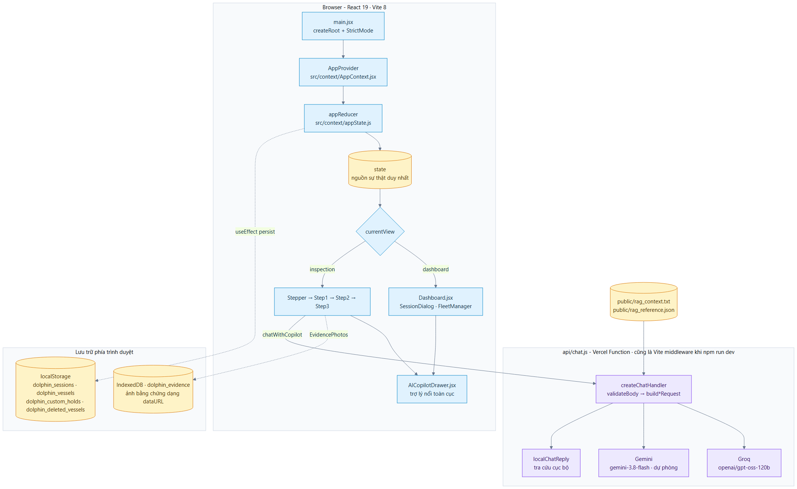

<details>
<summary>Mã Mermaid - nguồn sơ đồ</summary>

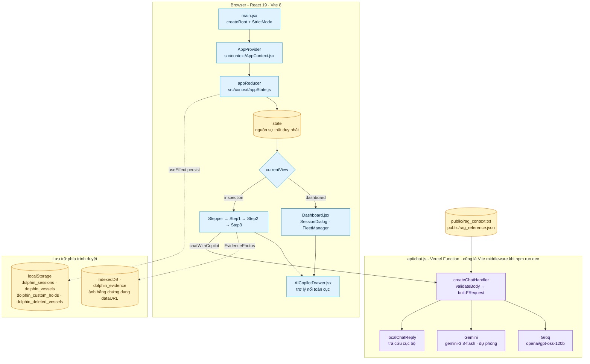

</details>

Không có router. `react-router-dom` nằm trong `package.json` nhưng không được import ở đâu; điều hướng hoàn toàn bằng `state.currentView` và `state.currentStep` trong [App.jsx](src/App.jsx).

---

## 2. Vòng đời ca làm việc

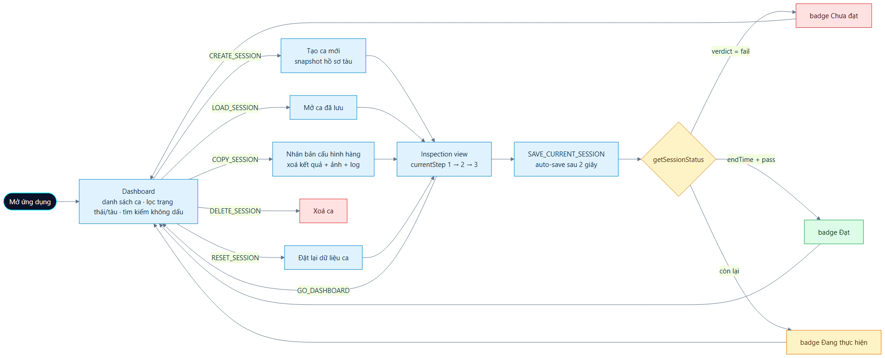

<details>
<summary>Mã Mermaid - nguồn sơ đồ</summary>

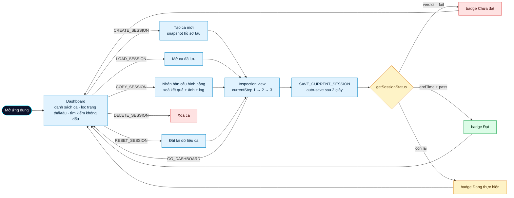

</details>

Cơ chế auto-save trong [AppContext.jsx](src/context/AppContext.jsx): mỗi khi field của ca thay đổi, một `setTimeout` 2 giây dispatch `SAVE_CURRENT_SESSION`; riêng `COMPLETE_INSPECTION` gọi đệ quy `SAVE_CURRENT_SESSION` ngay lập tức.

---

## 3. Luồng nghiệp vụ 3 bước

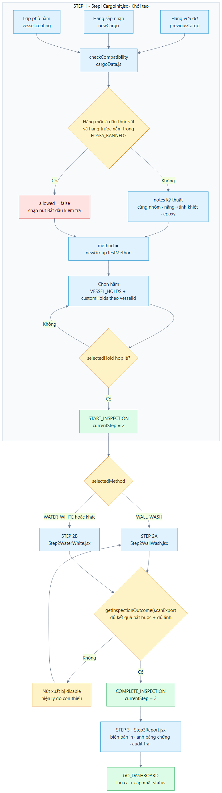

<details>
<summary>Mã Mermaid - nguồn sơ đồ</summary>

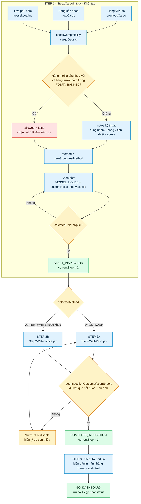

</details>

`getInspectionOutcome()` trong [inspectionOutcome.js](src/data/inspectionOutcome.js) là cổng gác duy nhất: nút bấm, badge trạng thái và nội dung báo cáo đều dùng chung một kết quả.

---

## 4. Nhánh Wall Wash

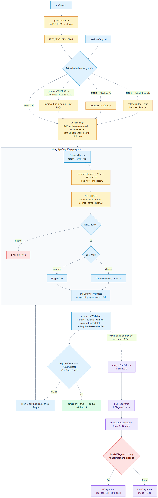

<details>
<summary>Mã Mermaid - nguồn sơ đồ</summary>

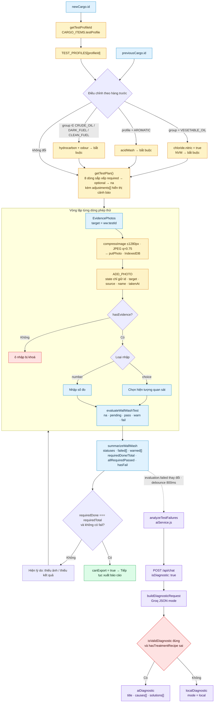

</details>

Chốt an toàn: `hasTreatmentRecipe()` trong [lib/copilot.js](lib/copilot.js) loại mọi dòng chứa công thức phần trăm, độ C hoặc giờ khỏi chỉ mục RAG, và `providerResult()` ném `UNVERIFIED_TREATMENT_RECIPE` để rơi về gợi ý cục bộ.

---

## 5. Nhánh Water White

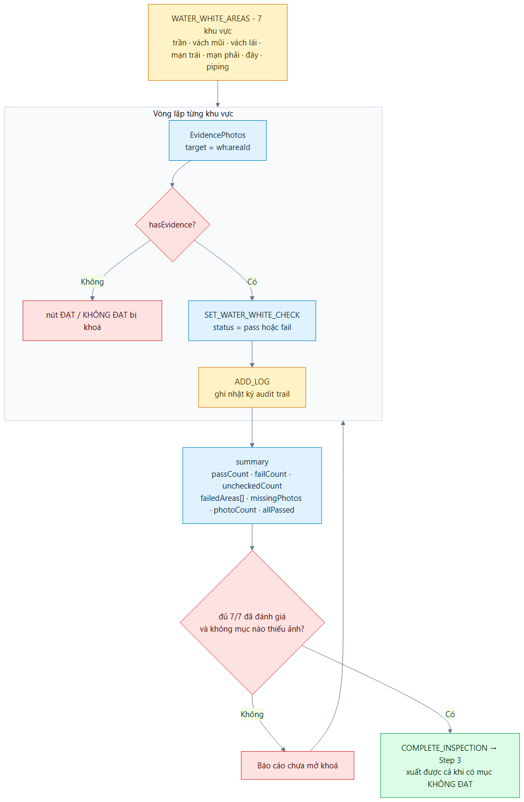

<details>
<summary>Mã Mermaid - nguồn sơ đồ</summary>

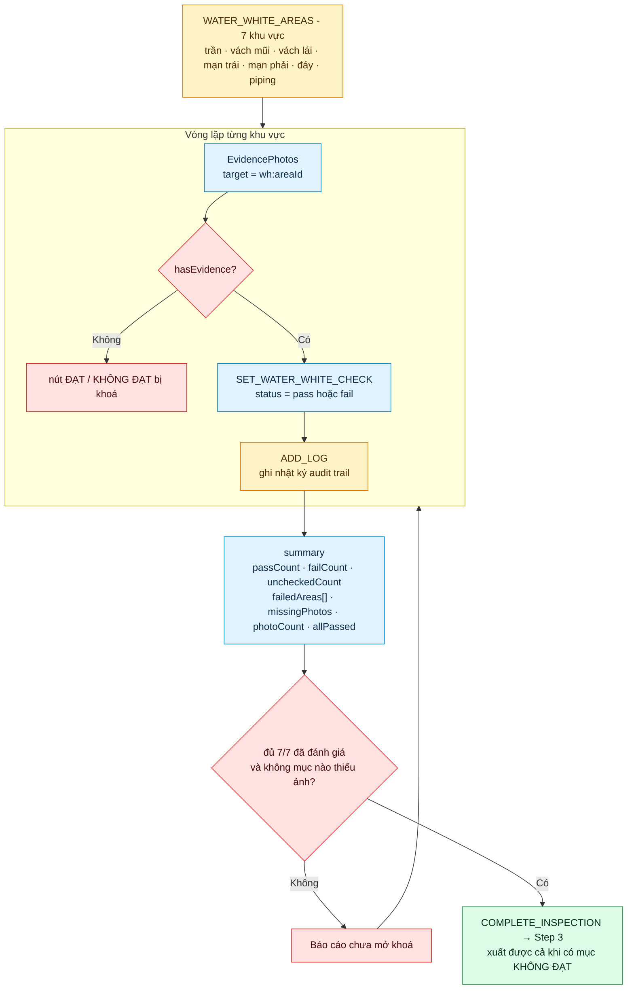

</details>

---

## 6. Luồng bằng chứng ảnh

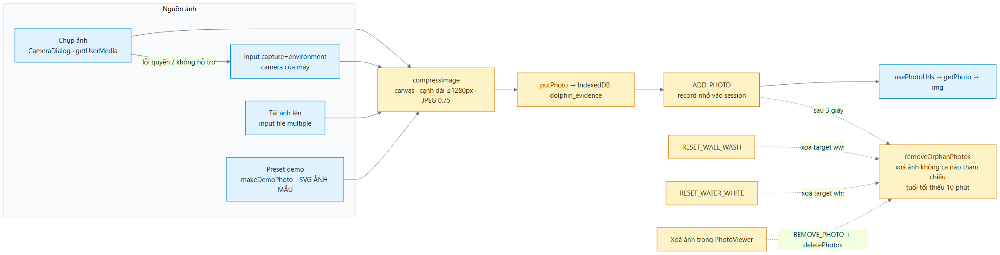

<details>
<summary>Mã Mermaid - nguồn sơ đồ</summary>

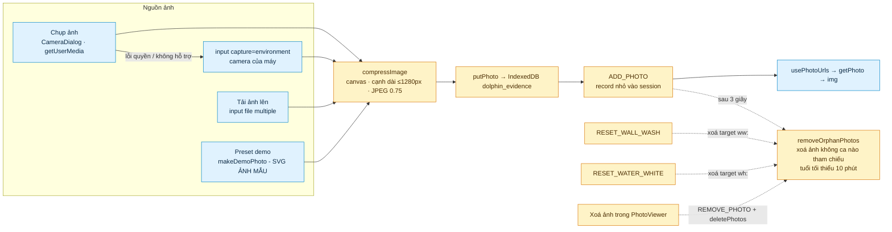

</details>

---

## 7. Luồng AI Copilot và RAG

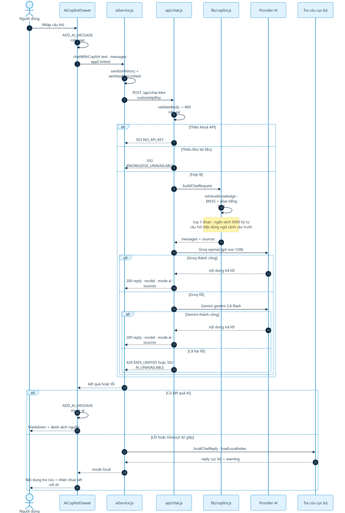

<details>
<summary>Mã Mermaid - nguồn sơ đồ</summary>

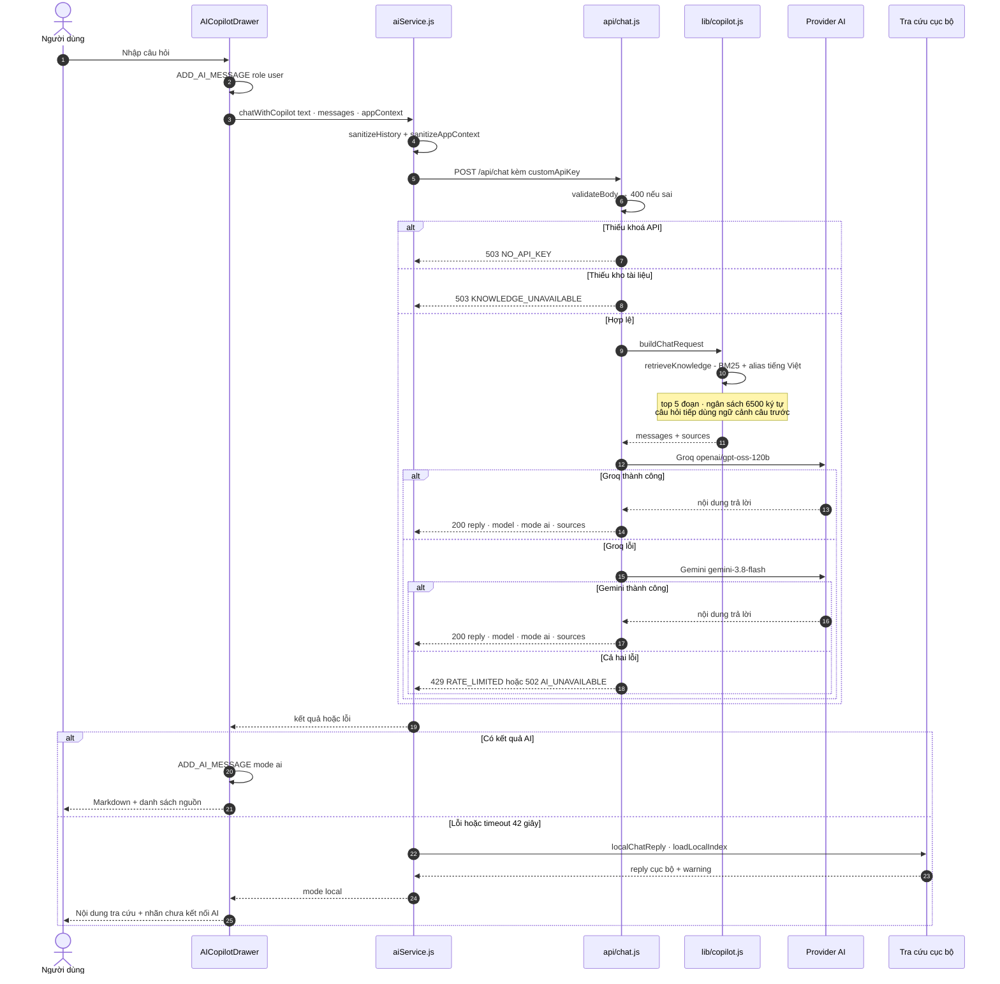

</details>

Ánh xạ mã lỗi:

| Mã HTTP | `error` | Ý nghĩa |
|:--:|---|---|
| 400 | `INVALID_REQUEST` | Body sai định dạng |
| 405 | `METHOD_NOT_ALLOWED` | Không phải POST/OPTIONS |
| 413 | `REQUEST_TOO_LARGE` | Vượt 32 KB - chỉ ở Vite middleware |
| 429 | `RATE_LIMITED` | Provider hết hạn mức |
| 502 | `AI_CONTEXT_TOO_LARGE` / `AI_UNAVAILABLE` | Vượt ngữ cảnh / không có phản hồi |
| 503 | `NO_API_KEY` · `KNOWLEDGE_UNAVAILABLE` · `AI_AUTH_FAILED` · `AI_MODEL_UNAVAILABLE` | Thiếu cấu hình hoặc provider từ chối |

---

## 8. Pipeline xây kho RAG

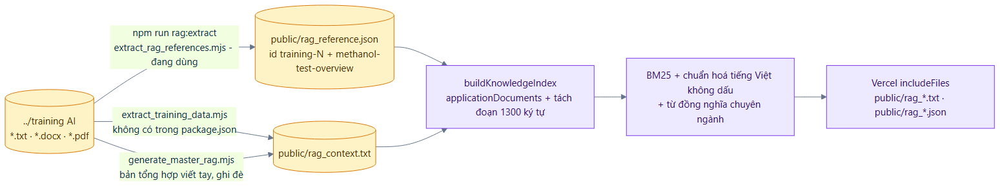

<details>
<summary>Mã Mermaid - nguồn sơ đồ</summary>

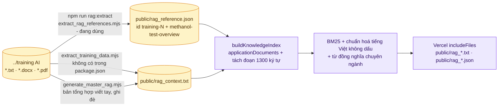

</details>

Hai script cùng ghi `public/rag_context.txt` và các PDF trong `training AI` chưa được đưa vào index, vì chỉ `extract_training_data.mjs` đọc PDF mà script này không có trong `package.json`.

---

## 9. Quản lý đội tàu và hầm

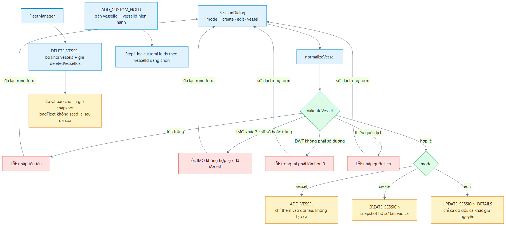

<details>
<summary>Mã Mermaid - nguồn sơ đồ</summary>

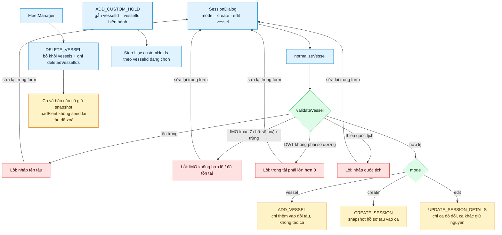

</details>

---

## 10. Bản đồ action của reducer

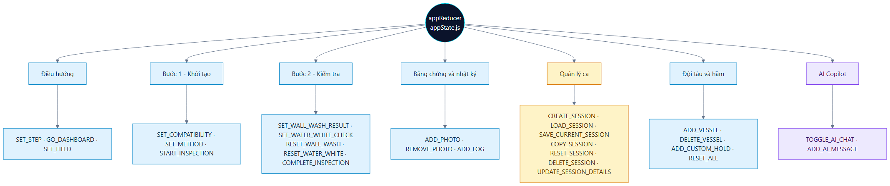

<details>
<summary>Mã Mermaid - nguồn sơ đồ</summary>

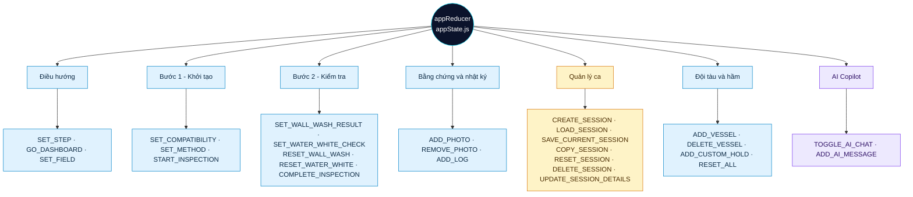

</details>

---

## 11. Luồng kiểm thử

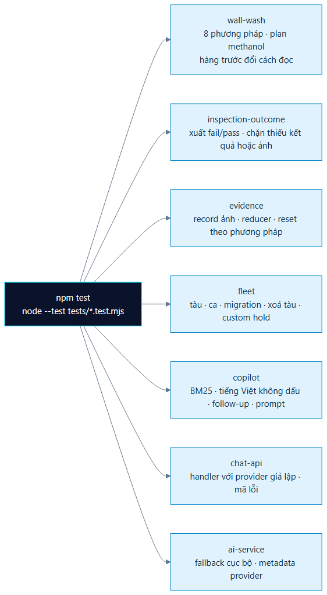

<details>
<summary>Mã Mermaid - nguồn sơ đồ</summary>

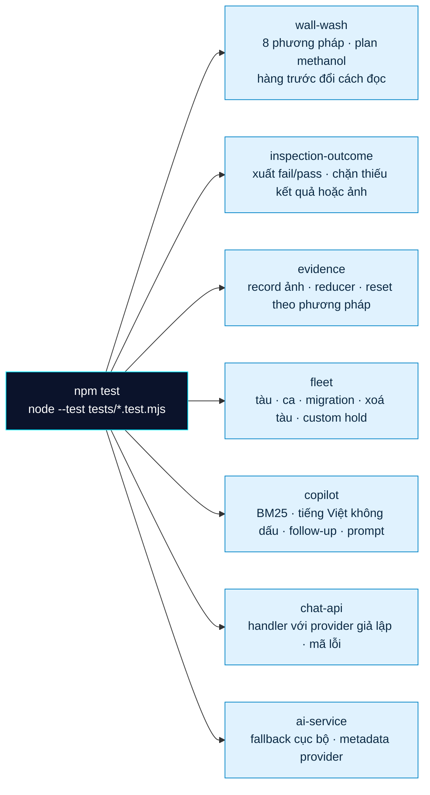

</details>

---

## 12. Render lại sơ đồ

Ảnh trong `docs/workflows/` được sinh tự động từ chính các khối Mermaid trong tài liệu này.

```sh
# Cài renderer một lần (không tải Chromium, dùng Chrome/Edge có sẵn trên máy)
npm install --no-save --no-audit --no-fund @mermaid-js/mermaid-cli@11

npm run docs:diagrams          # chỉ SVG
npm run docs:diagrams:png      # SVG + PNG (dùng cho ảnh nhúng trong tài liệu)
```

Script [scripts/render_workflow_diagrams.mjs](scripts/render_workflow_diagrams.mjs) tìm Chrome hoặc Edge theo biến `PUPPETEER_EXECUTABLE_PATH` hay các đường dẫn cài đặt mặc định, tách từng khối mã Mermaid trong tài liệu này, render thành `docs/workflows/NN-ten-so-do.svg` và ghi danh sách vào `docs/workflows/index.json`. Chạy lại script sau mỗi lần sửa sơ đồ rồi cập nhật ảnh nhúng.

---

## Ghi chú kiến trúc

| Điểm | Nhận xét |
|---|---|
| Một nguồn nghiệp vụ duy nhất | [src/data/wallWashTests.js](src/data/wallWashTests.js) được UI, báo cáo, `api/chat.js` và prompt AI import trực tiếp, nên ngưỡng không lệch giữa màn hình và AI |
| Không có router | `react-router-dom` là dependency thừa; điều hướng bằng state |
| Điều hướng Step 2 | Ternary trong `App.jsx`; nhánh mặc định luôn là Water White nếu `selectedMethod` không xác định |
| Lưu trữ tách tầng | Metadata ca ở `localStorage` (khoảng 5 MB); ảnh ở `IndexedDB` (hàng trăm MB) |
| Hai script RAG trùng chức năng | Chỉ `extract_rag_references.mjs` có trong `package.json` |
| Provider AI | Groq chính, Gemini dự phòng, tra cứu cục bộ là tầng cuối, luôn có câu trả lời |
